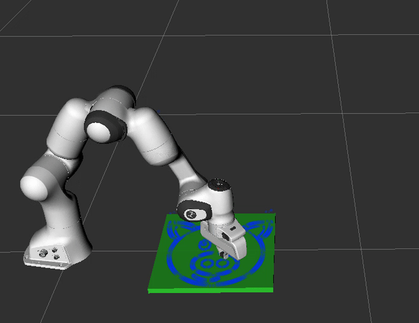

# Panda Painter

#### ROS Machine Setup  
###### Install ROS and Franka packages:  
* ROS (http://wiki.ros.org/Installation) 
* Franka (https://frankaemika.github.io/docs/installation.html)  
###### Install rosbridge:  
* sudo apt-get install ros-kinetic-rosbridge-server  
###### Install MoveIt:  
* sudo apt-get install ros-kinetic-moveit  
###### Build panda_server:  
* Copy the panda_server folder to the source directory of your ROS workspace.  
* Make sure all dependencies are installed: *rosdep install --from-paths src --ignore-src -r -y*  
* Open file move_group.launch in package panda_moveit_config and comment out the line: *remap from="/joint_states" to="/joint_states_desired"*

#### Remote Machine Setup  
* cd /path/to/panda_client
* pip install -r requirements.txt

### Quick Start  
#### On the ROS machine  
* For simulation, run: **roslaunch panda_server panda_sim.launch**  
* For the real robot, run: **roslaunch panda_server panda_real.launch**  
#### On the remote machine  
###### cd to panda_client/scripts directory  
Note: check each of these scripts to make sure 'ros_box_address' is set the the address of the ROS machine (use 172.16.0.2 if client is remote, or 127.0.0.1 if client is local).  
* Execute a hard-coded cartesian trajectory: **python3 cart_traj.py**   
* Move to cartesian poses: **python3 cart_poses.py**  
* Paint a picture: **python3 paint.py**  

* Try the command line tools: **python3 cli.py**
  * Move the arm to the home position: **home**  
  * Send a cartesian goal pose request: **cart_pos 0.5 0.3 0.5 0 0 0** (arguments are: x_pos, y_pos z_pos, x_rot, y_rot, z_rot)  
  * Send a joint position goal: **joint_pos -1.0 0.7 0.7 -1.5 -0.7 2.0 0.0** (arguments are: joint1 joint2 joint3 joint4 joint5 joint6 joint7. joint1 is the first revolute joint from the base.)  
  * Send a gripper command: **gripper_pos 0.04**  
  * List all tasks currently in the database: **list_tasks**  
  * Print a task to terminal: **print_task task_name**
  * Execute a task: **execute_task task_name**  
  * Remove task from the database: **remove_task task_name**  

### Remote Machine Communication  
The rosbridge package is used to handle communication between the remote machine and the ROS machine. Rosbridge uses websockets to send service requests and recieve replies. Service request messages must be formatted as json strings. See the script *painter_demo.py* for an example of how to write a service request message in json format.  

The following services run on the ROS machine and can be called from any remote machine:  
**goto_joint_pos** - Takes a list of joint goal positions from a JointTraj.srv service request and moves the arm to the desired joint space position.    
**execute_cart_traj** - Takes a list of waypoints from a CartTraj.srv service request and creates a path plan in MoveIt.  
**goto_gripper_pos** - Takes a Gripper.srv service request and moves the gripper to the desired position.  
**set_canvas** - Takes a SetCanvas.srv service request and sets the location and dimensions of the canvas. (used for path planning)  
**move_home** - Takes a Command.srv service request and moves the arm to the home position.  
**scale_limts** - Scale max velocity and acceleration (as set in the URDF) by a value 0-1.  
**Notes:**  
The service message deffinitions can be found in the *srv* directory.  
These services can be called from your own scripts or from the command line (panda_cmd_line.py).  
Use service 'goto_cart_pos' when you have a single cartesian goal point and 'execute_cart_traj' when you have many waypoints. 'execute_cart_traj' will plan with continuous velocity through all waypoints. 'goto_cart_pos' will set 0 velocity at each goal pose.  

The module *mongo_client.py* defines the *MongoClient* class which provides an interface to the Mongodb server running on the ros machine.   
The functions provided are:  
**add_task(task_name, task_list)** - Add a task to the database using 'task_name' as the key. A task is defined by a list of service calls.     
**remove_task(task_name)** - Remove task 'task_name' from the database.  
**execute_task(task_name)** - Execute the 'task_name' task.  
**list_tasks()** - List all tasks currently in the database.  
Note: These functions can be called from your own scripts or from the command line tools module (panda_cmd_line.py).  

### Painter Demo:  
